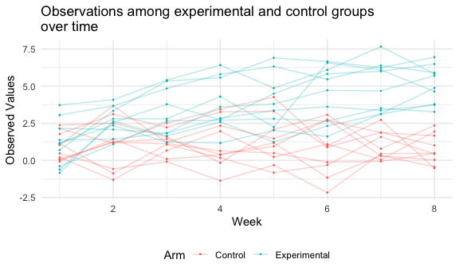

P8105 Homework 5
================
Heidi Lumish

## Problem 1

#### Import the data

First we will import the data from the GitHub repository.

``` r
urlfile="https://raw.githubusercontent.com/washingtonpost/data-homicides/master/homicide-data.csv"

homicides <- read_csv(url(urlfile))
```

    ## Rows: 52179 Columns: 12

    ## ── Column specification ────────────────────────────────────────────────────────
    ## Delimiter: ","
    ## chr (9): uid, victim_last, victim_first, victim_race, victim_age, victim_sex...
    ## dbl (3): reported_date, lat, lon

    ## 
    ## ℹ Use `spec()` to retrieve the full column specification for this data.
    ## ℹ Specify the column types or set `show_col_types = FALSE` to quiet this message.

#### Description of the data

Create a city\_state variable (e.g. “Baltimore, MD”) and then summarize
within cities to obtain the total number of homicides and the number of
unsolved homicides.

``` r
homicides_city = homicides %>% 
  mutate(
    city_state = paste(city, state, sep = ", "),
    unsolved = ifelse(disposition == "Closed without arrest" | disposition == "Open/No arrest", 1, 0)
    ) %>%
  group_by(city_state) %>%
  mutate(
    number_murders = n(),
    number_unsolved = sum(unsolved)) %>% 
  select(city_state, number_murders, number_unsolved) %>%   unique()
```

Run prop.test for Baltimore, MD

``` r
homicides_city %>% 
  filter(city_state == "Baltimore, MD")
```

    ## # A tibble: 1 × 3
    ## # Groups:   city_state [1]
    ##   city_state    number_murders number_unsolved
    ##   <chr>                  <int>           <dbl>
    ## 1 Baltimore, MD           2827            1825

``` r
proportion = function (x, n) {
  
  prop = prop.test(x, n)
  
  return(prop)
}

prop_baltimore = prop.test(1825, 2827)
broom::tidy(prop_baltimore)
```

    ## # A tibble: 1 × 8
    ##   estimate statistic  p.value parameter conf.low conf.high method    alternative
    ##      <dbl>     <dbl>    <dbl>     <int>    <dbl>     <dbl> <chr>     <chr>      
    ## 1    0.646      239. 6.46e-54         1    0.628     0.663 1-sample… two.sided

Run prop.test for each of the cities in the dataset and extract
proportion of unsolved homicides and confidence interval.

``` r
homicides_nested = homicides_city %>% 
  nest(data = number_murders:number_unsolved)
```

## Problem 2

#### Import and tidy the data

First we will import the data from the longitudinal study. Since data
for each participant is included in a separate file, first we create a
dataframe containing all file names (which are the subject ID and arm).
Next we will write a function to read data from the csv files. Then we
will use the purrr::map function to read in the data for each subject.
Finally, we will tidy the data by unnesting it, separating the arm and
subject IDs into separate columns, and using pivot longer to create a
“week” variable.

``` r
files_df = 
  tibble(file_name = list.files("./data")) 

subject_data = function(file_name){
  
  data = read_csv(str_c("./data/", file_name))
  
  return(data)
  
}

observations = files_df %>% 
  mutate(data = map(file_name, subject_data)) %>%
  unnest(data) %>%
  separate(file_name, c("arm", "subject_id"), "_") %>%
  mutate(subject_id = substr(subject_id, 1, 2),
         subject_id = as.numeric(subject_id)) %>% 
  pivot_longer(
    week_1:week_8,
    names_to = "week",
    names_prefix = "week_",
    values_to = "observations"
  ) %>% 
  mutate(week = as.numeric(week))
```

    ## Rows: 1 Columns: 8

    ## ── Column specification ────────────────────────────────────────────────────────
    ## Delimiter: ","
    ## dbl (8): week_1, week_2, week_3, week_4, week_5, week_6, week_7, week_8

    ## 
    ## ℹ Use `spec()` to retrieve the full column specification for this data.
    ## ℹ Specify the column types or set `show_col_types = FALSE` to quiet this message.

    ## Rows: 1 Columns: 8

    ## ── Column specification ────────────────────────────────────────────────────────
    ## Delimiter: ","
    ## dbl (8): week_1, week_2, week_3, week_4, week_5, week_6, week_7, week_8

    ## 
    ## ℹ Use `spec()` to retrieve the full column specification for this data.
    ## ℹ Specify the column types or set `show_col_types = FALSE` to quiet this message.

    ## Rows: 1 Columns: 8

    ## ── Column specification ────────────────────────────────────────────────────────
    ## Delimiter: ","
    ## dbl (8): week_1, week_2, week_3, week_4, week_5, week_6, week_7, week_8

    ## 
    ## ℹ Use `spec()` to retrieve the full column specification for this data.
    ## ℹ Specify the column types or set `show_col_types = FALSE` to quiet this message.

    ## Rows: 1 Columns: 8

    ## ── Column specification ────────────────────────────────────────────────────────
    ## Delimiter: ","
    ## dbl (8): week_1, week_2, week_3, week_4, week_5, week_6, week_7, week_8

    ## 
    ## ℹ Use `spec()` to retrieve the full column specification for this data.
    ## ℹ Specify the column types or set `show_col_types = FALSE` to quiet this message.

    ## Rows: 1 Columns: 8

    ## ── Column specification ────────────────────────────────────────────────────────
    ## Delimiter: ","
    ## dbl (8): week_1, week_2, week_3, week_4, week_5, week_6, week_7, week_8

    ## 
    ## ℹ Use `spec()` to retrieve the full column specification for this data.
    ## ℹ Specify the column types or set `show_col_types = FALSE` to quiet this message.

    ## Rows: 1 Columns: 8

    ## ── Column specification ────────────────────────────────────────────────────────
    ## Delimiter: ","
    ## dbl (8): week_1, week_2, week_3, week_4, week_5, week_6, week_7, week_8

    ## 
    ## ℹ Use `spec()` to retrieve the full column specification for this data.
    ## ℹ Specify the column types or set `show_col_types = FALSE` to quiet this message.

    ## Rows: 1 Columns: 8

    ## ── Column specification ────────────────────────────────────────────────────────
    ## Delimiter: ","
    ## dbl (8): week_1, week_2, week_3, week_4, week_5, week_6, week_7, week_8

    ## 
    ## ℹ Use `spec()` to retrieve the full column specification for this data.
    ## ℹ Specify the column types or set `show_col_types = FALSE` to quiet this message.

    ## Rows: 1 Columns: 8

    ## ── Column specification ────────────────────────────────────────────────────────
    ## Delimiter: ","
    ## dbl (8): week_1, week_2, week_3, week_4, week_5, week_6, week_7, week_8

    ## 
    ## ℹ Use `spec()` to retrieve the full column specification for this data.
    ## ℹ Specify the column types or set `show_col_types = FALSE` to quiet this message.

    ## Rows: 1 Columns: 8

    ## ── Column specification ────────────────────────────────────────────────────────
    ## Delimiter: ","
    ## dbl (8): week_1, week_2, week_3, week_4, week_5, week_6, week_7, week_8

    ## 
    ## ℹ Use `spec()` to retrieve the full column specification for this data.
    ## ℹ Specify the column types or set `show_col_types = FALSE` to quiet this message.

    ## Rows: 1 Columns: 8

    ## ── Column specification ────────────────────────────────────────────────────────
    ## Delimiter: ","
    ## dbl (8): week_1, week_2, week_3, week_4, week_5, week_6, week_7, week_8

    ## 
    ## ℹ Use `spec()` to retrieve the full column specification for this data.
    ## ℹ Specify the column types or set `show_col_types = FALSE` to quiet this message.

    ## Rows: 1 Columns: 8

    ## ── Column specification ────────────────────────────────────────────────────────
    ## Delimiter: ","
    ## dbl (8): week_1, week_2, week_3, week_4, week_5, week_6, week_7, week_8

    ## 
    ## ℹ Use `spec()` to retrieve the full column specification for this data.
    ## ℹ Specify the column types or set `show_col_types = FALSE` to quiet this message.

    ## Rows: 1 Columns: 8

    ## ── Column specification ────────────────────────────────────────────────────────
    ## Delimiter: ","
    ## dbl (8): week_1, week_2, week_3, week_4, week_5, week_6, week_7, week_8

    ## 
    ## ℹ Use `spec()` to retrieve the full column specification for this data.
    ## ℹ Specify the column types or set `show_col_types = FALSE` to quiet this message.

    ## Rows: 1 Columns: 8

    ## ── Column specification ────────────────────────────────────────────────────────
    ## Delimiter: ","
    ## dbl (8): week_1, week_2, week_3, week_4, week_5, week_6, week_7, week_8

    ## 
    ## ℹ Use `spec()` to retrieve the full column specification for this data.
    ## ℹ Specify the column types or set `show_col_types = FALSE` to quiet this message.

    ## Rows: 1 Columns: 8

    ## ── Column specification ────────────────────────────────────────────────────────
    ## Delimiter: ","
    ## dbl (8): week_1, week_2, week_3, week_4, week_5, week_6, week_7, week_8

    ## 
    ## ℹ Use `spec()` to retrieve the full column specification for this data.
    ## ℹ Specify the column types or set `show_col_types = FALSE` to quiet this message.

    ## Rows: 1 Columns: 8

    ## ── Column specification ────────────────────────────────────────────────────────
    ## Delimiter: ","
    ## dbl (8): week_1, week_2, week_3, week_4, week_5, week_6, week_7, week_8

    ## 
    ## ℹ Use `spec()` to retrieve the full column specification for this data.
    ## ℹ Specify the column types or set `show_col_types = FALSE` to quiet this message.

    ## Rows: 1 Columns: 8

    ## ── Column specification ────────────────────────────────────────────────────────
    ## Delimiter: ","
    ## dbl (8): week_1, week_2, week_3, week_4, week_5, week_6, week_7, week_8

    ## 
    ## ℹ Use `spec()` to retrieve the full column specification for this data.
    ## ℹ Specify the column types or set `show_col_types = FALSE` to quiet this message.

    ## Rows: 1 Columns: 8

    ## ── Column specification ────────────────────────────────────────────────────────
    ## Delimiter: ","
    ## dbl (8): week_1, week_2, week_3, week_4, week_5, week_6, week_7, week_8

    ## 
    ## ℹ Use `spec()` to retrieve the full column specification for this data.
    ## ℹ Specify the column types or set `show_col_types = FALSE` to quiet this message.

    ## Rows: 1 Columns: 8

    ## ── Column specification ────────────────────────────────────────────────────────
    ## Delimiter: ","
    ## dbl (8): week_1, week_2, week_3, week_4, week_5, week_6, week_7, week_8

    ## 
    ## ℹ Use `spec()` to retrieve the full column specification for this data.
    ## ℹ Specify the column types or set `show_col_types = FALSE` to quiet this message.

    ## Rows: 1 Columns: 8

    ## ── Column specification ────────────────────────────────────────────────────────
    ## Delimiter: ","
    ## dbl (8): week_1, week_2, week_3, week_4, week_5, week_6, week_7, week_8

    ## 
    ## ℹ Use `spec()` to retrieve the full column specification for this data.
    ## ℹ Specify the column types or set `show_col_types = FALSE` to quiet this message.

    ## Rows: 1 Columns: 8

    ## ── Column specification ────────────────────────────────────────────────────────
    ## Delimiter: ","
    ## dbl (8): week_1, week_2, week_3, week_4, week_5, week_6, week_7, week_8

    ## 
    ## ℹ Use `spec()` to retrieve the full column specification for this data.
    ## ℹ Specify the column types or set `show_col_types = FALSE` to quiet this message.

#### Spaghetti plot

Next we will make a spaghetti plot showing observations on each subject
over time.

``` r
observations %>% 
  ggplot(aes(x = week, y = observations, color = arm)) +
  geom_point(size = .2) + 
  geom_line(aes(group = interaction(arm, subject_id)), alpha = .3) +
  labs(
    title = "Observations among experimental and control groups \nover time",
    x = "Week",
    y = "Observed Values") +
  scale_color_discrete(name = "Arm", labels = c("Control", "Experimental"))
```



The spaghetti plot shows that the values among the control subjects are
relatively constant over time, whereas the values for the experimental
subjects increase over time.

Alternative to maps function above

``` r
files_df %>% 
  mutate(data = subject_data(file_name)) %>% view()
```

    ## Rows: 20 Columns: 8

    ## ── Column specification ────────────────────────────────────────────────────────
    ## Delimiter: ","
    ## dbl (8): week_1, week_2, week_3, week_4, week_5, week_6, week_7, week_8

    ## 
    ## ℹ Use `spec()` to retrieve the full column specification for this data.
    ## ℹ Specify the column types or set `show_col_types = FALSE` to quiet this message.

## Problem 3

#### Load the iris dataset and introduce missing values

``` r
set.seed(10)

iris_with_missing = iris %>% 
  map_df(~replace(.x, sample(1:150, 20), NA)) %>%
  mutate(Species = as.character(Species))
```

Write a function that replaces missing values

``` r
missing = function(x){
  if (is.character(x)) {
    x[is.na(x)] <- "virginica"
  }
  
  if (!is.character(x)) {
  x[is.na(x)] <- mean(x, na.rm = TRUE)

  }
  
  return(x)
}

missing(iris_with_missing$Sepal.Length)
```

    ##   [1] 5.100000 4.900000 4.700000 4.600000 5.000000 5.400000 5.819231 5.000000
    ##   [9] 4.400000 4.900000 5.400000 4.800000 5.819231 4.300000 5.819231 5.700000
    ##  [17] 5.400000 5.100000 5.700000 5.100000 5.400000 5.100000 4.600000 5.819231
    ##  [25] 4.800000 5.000000 5.000000 5.200000 5.819231 4.700000 4.800000 5.400000
    ##  [33] 5.200000 5.500000 4.900000 5.000000 5.500000 4.900000 4.400000 5.100000
    ##  [41] 5.000000 4.500000 4.400000 5.000000 5.100000 4.800000 5.100000 4.600000
    ##  [49] 5.300000 5.000000 7.000000 6.400000 6.900000 5.500000 6.500000 5.700000
    ##  [57] 6.300000 4.900000 6.600000 5.200000 5.000000 5.900000 6.000000 6.100000
    ##  [65] 5.600000 6.700000 5.600000 5.800000 6.200000 5.600000 5.900000 5.819231
    ##  [73] 6.300000 5.819231 6.400000 6.600000 6.800000 6.700000 6.000000 5.700000
    ##  [81] 5.500000 5.819231 5.800000 6.000000 5.400000 5.819231 6.700000 5.819231
    ##  [89] 5.600000 5.500000 5.500000 5.819231 5.800000 5.000000 5.819231 5.700000
    ##  [97] 5.700000 6.200000 5.100000 5.700000 6.300000 5.800000 7.100000 6.300000
    ## [105] 6.500000 7.600000 4.900000 7.300000 6.700000 5.819231 6.500000 5.819231
    ## [113] 6.800000 5.700000 5.800000 6.400000 6.500000 7.700000 7.700000 6.000000
    ## [121] 5.819231 5.600000 7.700000 6.300000 6.700000 7.200000 6.200000 6.100000
    ## [129] 6.400000 7.200000 7.400000 7.900000 6.400000 5.819231 6.100000 5.819231
    ## [137] 5.819231 6.400000 6.000000 6.900000 6.700000 6.900000 5.819231 6.800000
    ## [145] 6.700000 6.700000 6.300000 6.500000 5.819231 5.900000

``` r
iris_with_missing %>%
  mutate(Sepal.Length = map(Sepal.Length, missing),
         Sepal.Width = map(Sepal.Width, missing),
         Petal.Length = map(Petal.Length, missing),
         Petal.Width = map(Petal.Width, missing),
         Species = map(Species, missing)) %>%  view()
```
