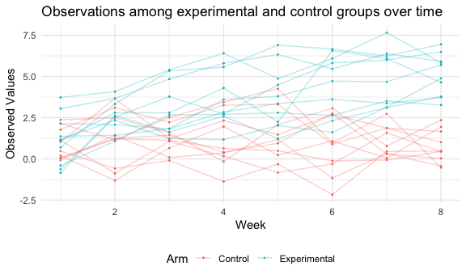

P8105 Homework 5
================
Heidi Lumish

## Problem 1: Homicides

#### Import the data

First we will import and clean the homicides dataset. We will replace
blank cells and those marked “Unknown” with “NA.” We will create a new
city\_state variable and a variable indicating whether the homicide was
solved or unsolved, labeled “resolution.” Finally, we will eliminate the
“Tulsa, AL” location since this is clearly an error, as Tulsa is in OK.

``` r
urlfile="https://raw.githubusercontent.com/washingtonpost/data-homicides/master/homicide-data.csv"

homicides_df = read_csv(url(urlfile), na = c("", "Unknown")) %>%
  mutate(city_state = paste(city, state, sep = ", "),
                     resolution = case_when(
                       disposition == "Closed without arrest" ~ "unsolved",
                       disposition == "Open/No arrest" ~ "unsolved",
                       disposition == "Closed by arrest" ~ "solved")) %>% 
  relocate(city_state) %>% 
  filter(city_state != "Tulsa, AL")
```

#### Baltimore, MD

Next, we will use prop.test to estimate the proportion of homicides that
are unsolved.

``` r
baltimore_df =
  homicides_df %>% 
  filter(city_state == "Baltimore, MD")

baltimore_summary = baltimore_df %>% 
  summarize(
    unsolved = sum(resolution == "unsolved"),
    n = n()
  )

baltimore_test = 
  prop.test(
  x = baltimore_summary %>% pull(unsolved),
  n = baltimore_summary %>% pull(n))

baltimore_test %>% 
  broom::tidy() %>% 
  knitr::kable(
    caption = "Estimate for proportion of unsolved homicides in Baltimore, MD"
  )
```

|  estimate | statistic | p.value | parameter |  conf.low | conf.high | method                                               | alternative |
|----------:|----------:|--------:|----------:|----------:|----------:|:-----------------------------------------------------|:------------|
| 0.6455607 |   239.011 |       0 |         1 | 0.6275625 | 0.6631599 | 1-sample proportions test with continuity correction | two.sided   |

Estimate for proportion of unsolved homicides in Baltimore, MD

#### All cities

Next we will run prop.test across all cities. First we will write a
function to summarize the data for each city and then run prop.test.

``` r
prop_test_function = function(df) {
  
  city_summary = 
    df %>% 
    summarize(
      unsolved = sum(resolution == "unsolved"),
      n = n()
    )
  
  city_test = 
    prop.test(
      x = city_summary %>% pull(unsolved),
      n = city_summary %>% pull(n))
  
  return(city_test)
  
}
```

Next we will use the map function to iterate across cities.

``` r
results_df = homicides_df %>% 
  nest(data = uid:resolution) %>% 
  mutate(
    test_results = map(data, prop_test_function),
    tidy_results = map(test_results, broom::tidy)
  ) %>% 
  select(city_state, tidy_results) %>% 
  unnest(tidy_results) %>% 
  select(city_state, estimate, starts_with("conf"))

results_df %>% knitr::kable()
```

| city\_state        |  estimate |  conf.low | conf.high |
|:-------------------|----------:|----------:|----------:|
| Albuquerque, NM    | 0.3862434 | 0.3372604 | 0.4375766 |
| Atlanta, GA        | 0.3833505 | 0.3528119 | 0.4148219 |
| Baltimore, MD      | 0.6455607 | 0.6275625 | 0.6631599 |
| Baton Rouge, LA    | 0.4622642 | 0.4141987 | 0.5110240 |
| Birmingham, AL     | 0.4337500 | 0.3991889 | 0.4689557 |
| Boston, MA         | 0.5048860 | 0.4646219 | 0.5450881 |
| Buffalo, NY        | 0.6122841 | 0.5687990 | 0.6540879 |
| Charlotte, NC      | 0.2998544 | 0.2660820 | 0.3358999 |
| Chicago, IL        | 0.7358627 | 0.7239959 | 0.7473998 |
| Cincinnati, OH     | 0.4452450 | 0.4079606 | 0.4831439 |
| Columbus, OH       | 0.5304428 | 0.5002167 | 0.5604506 |
| Dallas, TX         | 0.4811742 | 0.4561942 | 0.5062475 |
| Denver, CO         | 0.5416667 | 0.4846098 | 0.5976807 |
| Detroit, MI        | 0.5883287 | 0.5687903 | 0.6075953 |
| Durham, NC         | 0.3659420 | 0.3095874 | 0.4260936 |
| Fort Worth, TX     | 0.4644809 | 0.4222542 | 0.5072119 |
| Fresno, CA         | 0.3470226 | 0.3051013 | 0.3913963 |
| Houston, TX        | 0.5074779 | 0.4892447 | 0.5256914 |
| Indianapolis, IN   | 0.4493192 | 0.4223156 | 0.4766207 |
| Jacksonville, FL   | 0.5111301 | 0.4820460 | 0.5401402 |
| Kansas City, MO    | 0.4084034 | 0.3803996 | 0.4370054 |
| Las Vegas, NV      | 0.4141926 | 0.3881284 | 0.4407395 |
| Long Beach, CA     | 0.4126984 | 0.3629026 | 0.4642973 |
| Los Angeles, CA    | 0.4900310 | 0.4692208 | 0.5108754 |
| Louisville, KY     | 0.4531250 | 0.4120609 | 0.4948235 |
| Memphis, TN        | 0.3190225 | 0.2957047 | 0.3432691 |
| Miami, FL          | 0.6048387 | 0.5685783 | 0.6400015 |
| Milwaukee, wI      | 0.3614350 | 0.3333172 | 0.3905194 |
| Minneapolis, MN    | 0.5109290 | 0.4585150 | 0.5631099 |
| Nashville, TN      | 0.3624511 | 0.3285592 | 0.3977401 |
| New Orleans, LA    | 0.6485356 | 0.6231048 | 0.6731615 |
| New York, NY       | 0.3875598 | 0.3494421 | 0.4270755 |
| Oakland, CA        | 0.5364308 | 0.5040588 | 0.5685037 |
| Oklahoma City, OK  | 0.4851190 | 0.4467861 | 0.5236245 |
| Omaha, NE          | 0.4132029 | 0.3653146 | 0.4627477 |
| Philadelphia, PA   | 0.4478103 | 0.4300380 | 0.4657157 |
| Phoenix, AZ        | 0.5514223 | 0.5184825 | 0.5839244 |
| Pittsburgh, PA     | 0.5340729 | 0.4942706 | 0.5734545 |
| Richmond, VA       | 0.2634033 | 0.2228571 | 0.3082658 |
| San Antonio, TX    | 0.4285714 | 0.3947772 | 0.4630331 |
| Sacramento, CA     | 0.3696809 | 0.3211559 | 0.4209131 |
| Savannah, GA       | 0.4674797 | 0.4041252 | 0.5318665 |
| San Bernardino, CA | 0.6181818 | 0.5576628 | 0.6753422 |
| San Diego, CA      | 0.3796095 | 0.3354259 | 0.4258315 |
| San Francisco, CA  | 0.5067873 | 0.4680516 | 0.5454433 |
| St. Louis, MO      | 0.5396541 | 0.5154369 | 0.5636879 |
| Stockton, CA       | 0.5990991 | 0.5517145 | 0.6447418 |
| Tampa, FL          | 0.4567308 | 0.3881009 | 0.5269851 |
| Tulsa, OK          | 0.3310463 | 0.2932349 | 0.3711192 |
| Washington, DC     | 0.4379182 | 0.4112495 | 0.4649455 |

Finally, we will create a plot showing the estimates and confidence
intervals for each city.

``` r
results_df %>% 
  mutate(city_state = fct_reorder(city_state, estimate)) %>% 
  ggplot(aes(x = city_state, y = estimate)) + 
  geom_point() +
  geom_errorbar(aes(ymin = conf.low, ymax = conf.high)) +
  theme(axis.text.x = element_text(angle = 90, vjust = 0.5, hjust=1)) +
  labs(
    title = "Estimated proportion of unsolved homicides by city",
    x = "City",
    y = "Estimate")
```


## Problem 2: Longitudinal Study

#### Import and tidy the data

First we will import the data from the longitudinal study. Since data
for each participant is included in a separate file, first we create a
dataframe containing all file names (which are the subject ID and arm).
Next we will write a function to read data from the csv files. Then we
will use the purrr::map function to read in the data for each subject.
Finally, we will tidy the data by unnesting it, separating the arm and
subject IDs into separate columns, and using pivot longer to create a
“week” variable.

``` r
files_df = 
  tibble(file_name = list.files("./data")) 

subject_data = function(file_name){
  
  data = read_csv(str_c("./data/", file_name))
  
  return(data)
  
}

observations = files_df %>% 
  mutate(data = map(file_name, subject_data)) %>%
  unnest(data) %>%
  separate(file_name, c("arm", "subject_id"), "_") %>%
  mutate(subject_id = substr(subject_id, 1, 2),
         subject_id = as.numeric(subject_id)) %>% 
  pivot_longer(
    week_1:week_8,
    names_to = "week",
    names_prefix = "week_",
    values_to = "observations"
  ) %>% 
  mutate(week = as.numeric(week))
```

#### Spaghetti plot

Next we will make a spaghetti plot showing observations on each subject
over time.

``` r
observations %>% 
  ggplot(aes(x = week, y = observations, color = arm)) +
  geom_point(size = .2) + 
  geom_line(aes(group = interaction(arm, subject_id)), alpha = .3) +
  labs(
    title = "Observations among experimental and control groups over time",
    x = "Week",
    y = "Observed Values") +
  scale_color_discrete(name = "Arm", labels = c("Control", "Experimental"))
```



The spaghetti plot shows that the values among the control subjects are
relatively constant over time, whereas the values for the experimental
subjects increase over time.

## Problem 3: Iris dataset

First we will load the iris dataset and introduce missing values, using
the sample code.

``` r
set.seed(10)

iris_with_missing = iris %>% 
  map_df(~replace(.x, sample(1:150, 20), NA)) %>%
  mutate(Species = as.character(Species))
```

Next, we will write a function that replaces missing values. For numeric
variables, the missing values will be filled in with the mean of the
non-missing variables. For character variables, missing values will be
filled in with “virginica.”

``` r
missing = function(x){
  if (is.character(x)) {
    x[is.na(x)] <- "virginica"
  }
  
  if (is.numeric(x)) {

  x[is.na(x)] <- mean(x, na.rm = TRUE)

  }
  
  return(x)
}
```

Next we will apply the “missing” function written above to the
iris\_with\_missing dataset and create a new dataset named
iris\_no\_missing. By counting “NA” values, we see that the 100 missing
values have now been filled in.

``` r
iris_no_missing = iris_with_missing %>%
  map_df(missing)

sum(is.na(iris_with_missing))
```

    ## [1] 100

``` r
sum(is.na(iris_no_missing))
```

    ## [1] 0
